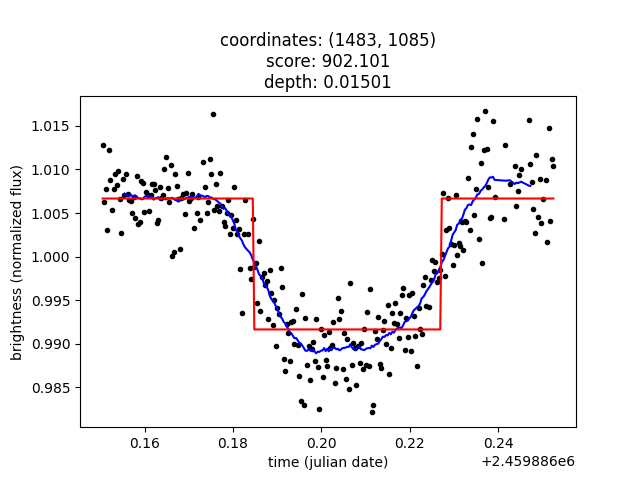

# ExoScanner
The program ExoScanner (now available even with a GUI) is able to analyze an image-series for exoplanet transits.

## What is this?
ExoScanner is a software which can analyze image-series recorded by amateurs
with the goal of detecting exoplanet-transits in them. The project started as
a high-school paper. But because I think that it might be useful for others,
I am publishing it. I hope to be able to maintain the program.

## How to install?

The program can be downloaded as a .exe, runnable on any windows machine (recommended):

TODO: Add link to .exe

Or, if you want to install ExoScanner as a python-package, ExoScanner can be installed with pip:
```
pip install https://github.com/josia-john/ExoScanner/archive/main.zip
```

## How to use?
You can run ExoScanner by running the downloaded .exe. Currently, ExoScanner only
supports .fits files. Enter the directory location of the files 
to be processed and then click submit. 

When the light-frames are sorted by name, they should also be sorted by observation-time.

Exoscanner saves the output files in the output directory that was specified when running it.
Make sure that there is nothing important there. It generates 10 images (like the one below), of the stars it thinks
it's most likely that a transit occured.



An example data-set to test the software can be found here: 
https://drive.google.com/drive/folders/13AZ1xhNR8qf8G5aFWLcC5ObRZvBCNXpz?usp=sharing

Alternatively, the program can also be run through the command line (if you
installed ExoScanner as a package) with the following command:
```
python -m ExoScanner <path> <output>
```
with `<path>` being the path to a folder with the to be analyzed light-frames.
and `<output>` being the path to the folder where the output images should be
saved.

On mac, you can install ExoScanner as a python-package. Then you can run the following command to
run ExoScanner with a GUI:

```
python -m ExoScanner
```

## How to compile with pyinstaller?
The program can be "compiled" into a .exe file using pyinstaller: Be sure to replace "\<path>\" with the location to the cli.py file
```
pyinstaller --noconfirm --onefile --console --name "ExoScanner" --hidden-import "photutils.geometry.core" --collect-data "photutils" --hidden-import "ttkthemes"  "<path>/cli.py"
```

## FAQ
If you have any questions, feel free to contact me! I can be reached at [me@jlabs.anonaddy.com](mailto:me@jlabs.anonaddy.com)

If you already want a copy of my paper, please also contact me. The final version
will be uploaded here on January 9th though.
